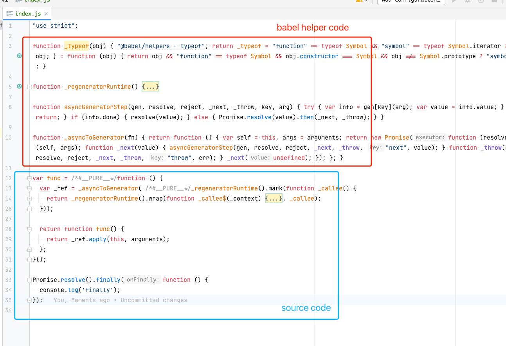
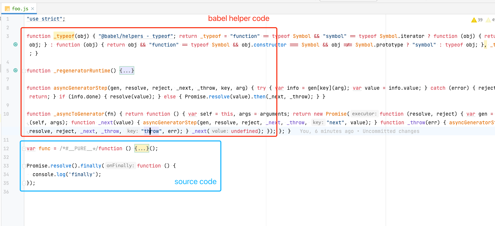
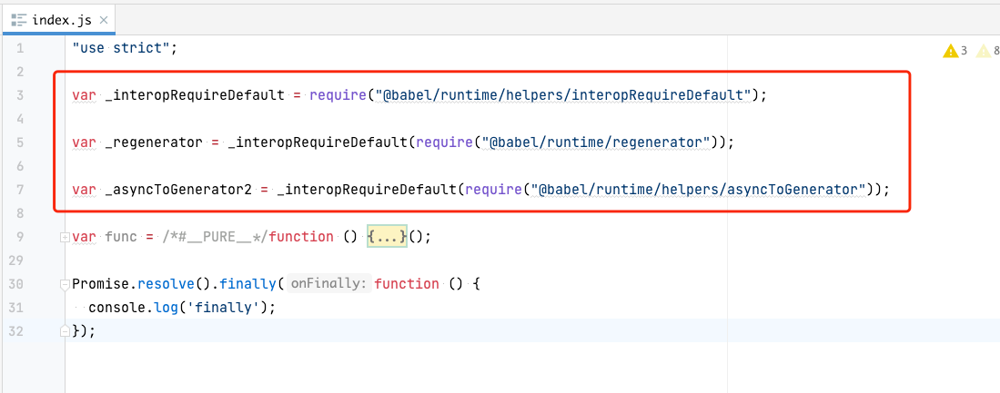
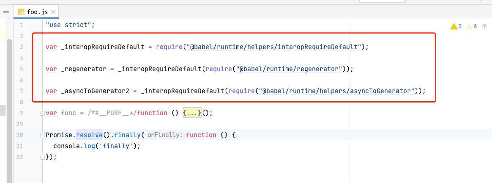
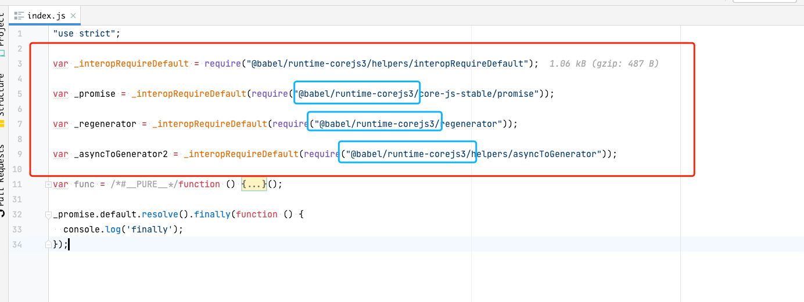

# 关于 `@babel/runtime`、`@babel/runtime-corejs`与`@babel/plugin-transform-runtime`的概念梳理


首先，不使用任何插件和`polyfill`，用下面这样的配置编译代码：
```json
{
  "presets": [
    [
      "@babel/preset-env",
      {
        "targets": {
          "ie": "11"
        },
        "useBuiltIns": false
      }
    ]
  ]
}
```
根据上面的配置，我们知道只针对IE11做语法降级处理，不注入任何Polyfill。

假设我们的源码有2个文件，内容如下：
```js
// src/index.js
const func = async () => {
    console.log('index.js')
}

Promise.resolve().finally(() => {
    console.log('finally')
})

// src/foo.js
const func = async () => {
    console.log('foo.js')
}

Promise.resolve().finally(() => {
    console.log('finally')
})
```
那么，最终的编译结果可以查看 [dist/index.js](assets/dist/v1/index.js) 和 [dist/foo.js](assets/dist/v1/foo.js) 的效果。




观察上面的截图可知，每一个输出文件都内置了babel的一些helper，而这些helper代码其实都是一样的，可想而知最终的打包结果有多大！

首先想到的解决方案就是把这些helper抽出单独的包，然后所有的输出文件都只是引用它。而这个helper包就叫`@babel/runtime`，然后通过插件`@babel/plugin-transform-runtime`来将编译结果中的babel helper代码改成对这个包的引用。

使用下面的配置重新编译：
```json
{
  "presets": [
    [
      "@babel/preset-env",
      {
        "targets": {
          "ie": "11"
        },
        "useBuiltIns": false
      }
    ]
  ],
  "plugins": [
    [
      "@babel/plugin-transform-runtime"
    ]
  ]
}
```



可以看到，此时结果中的helper代码都是引用的`@babel/runtime`包里面的代码。

总结一下就是，`@babel/runtime`是`babel`抽离出的一个包含了所有在语法降级过程中用到的`helper`集合，而`@babel/plugin-transform-runtime`是一个处理`helper`代码的插件，用于将原先内置的`helper`代码替换成对`@babel/runtime`引用的形式，减小编译结果的体积。

那`@babel/runtime-corejs2`又是什么呢？

其实`@babel/plugin-transform-runtime`这个插件还可以进行配置，如下：
```json
{
  "presets": [
    [
      "@babel/preset-env",
      {
        "targets": {
          "ie": "11"
        },
        "useBuiltIns": false
      }
    ]
  ],
  "plugins": [
    [
      "@babel/plugin-transform-runtime",
      {
        "corejs": 3
      }
    ]
  ]
}
```
我们告诉这个插件，所有的helper代码都采用`@babel/runtime-corejs3`的引用。
编译结果如下：

可以发现，所有的helper代码都变成了`@babel/runtime-corejs3`包中的引用了，也就是说，`transform-runtime`这个插件的`corejs`选项决定了最终使用哪个包里面的`helper`代码。

那这两个包里面的`helper`代码有什么区别呢？

更多细节可以查看[语法降级与Polyfill](https://juejin.cn/book/7050063811973218341/section/7066611951547187214)
