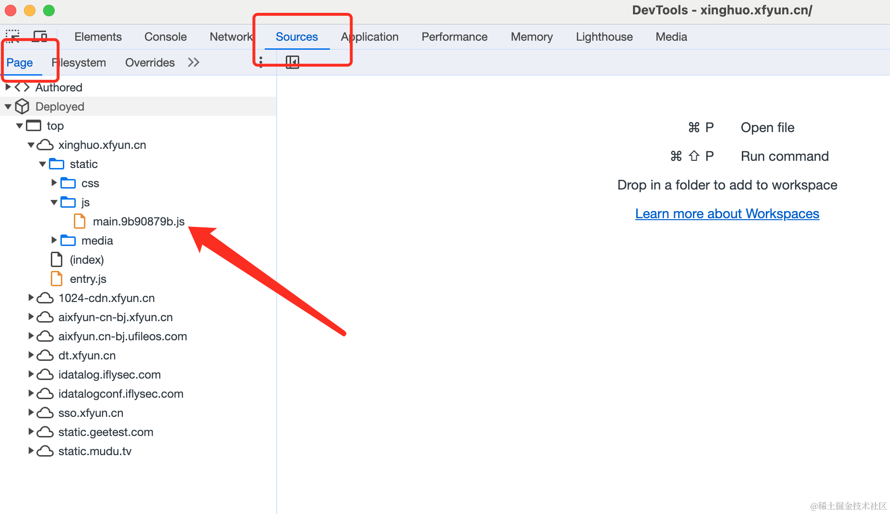
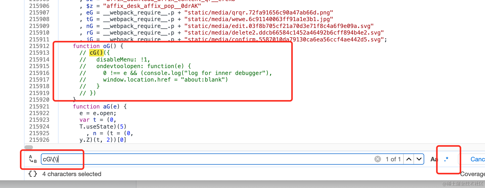
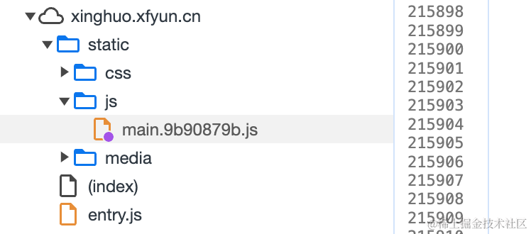
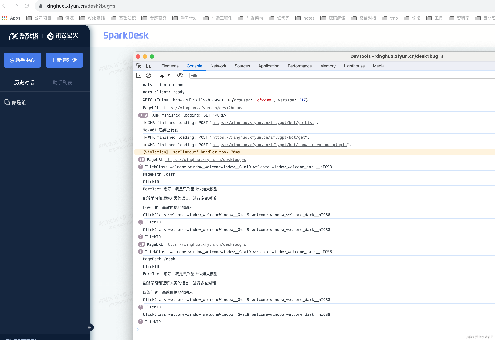

# 关于前端破解反调试的想法

之前曾做过微信读书的书籍下载，了解过一些反调试的做法。今天逛掘金时又碰到了相关的[帖子](https://juejin.cn/post/7262175454714626108)，看评论说讯飞大模型的破解不了，于是就想练练手，用了大概不到3个小时吧，就搞定了，然后就有了这篇文章。

> 免责声明：此文章纯粹是技术交流，请勿用于任何损害相关方利益的行为。

下面是破解步骤：

第一步，进入到首页 https://xinghuo.xfyun.cn ，打开控制台。

> 因为首页并没有禁用控制台，所以我们可以在这个页面提前做一些工作

第二步，打开 Source -> Page 面板，找到网站的`main.js`文件。

> 这个文件就是网站打包的主文件




第三步，打开这个文件，搜索`cG\(\)`这个正则，如下图所示：




最后一步，注释掉`cG`函数的调用，如上图所示，然后保存。

> 保存后如果发现文件名旁边有一个小紫点，就说明成功了，如下图所示：
>
> 


最后的最后，继续查看这个函数的调用，发现程序员留了个后门，直接在 url 里面加上`bug=s`即可：

```
https://xinghuo.xfyun.cn/desk?bug=s
```




下面是我的想法：

前端反调试，到目前为止，我还没有碰到过无法破解的网站(也可能是我见识短浅)，无论是浏览器插件还是 Overrides，亦或是 Charles/WireShark 抓包，都可以拿到并修改js代码，所以一切防止调试甚至查看js代码的行为都是徒劳的，开发者应该把更多的重心放在服务器端的验证上面。

这是我个人目前的愚见，欢迎各位大佬们相互讨论，相互学习。


最后，附上一些可能有用的链接：
1. 这个网站使用的反调试技术是 [disable-devtool](https://github.com/theajack/disable-devtool)
2. 破解反调试的神器: [Overrides](https://developer.chrome.com/blog/new-in-devtools-65/?utm_source=devtools#overrides)
