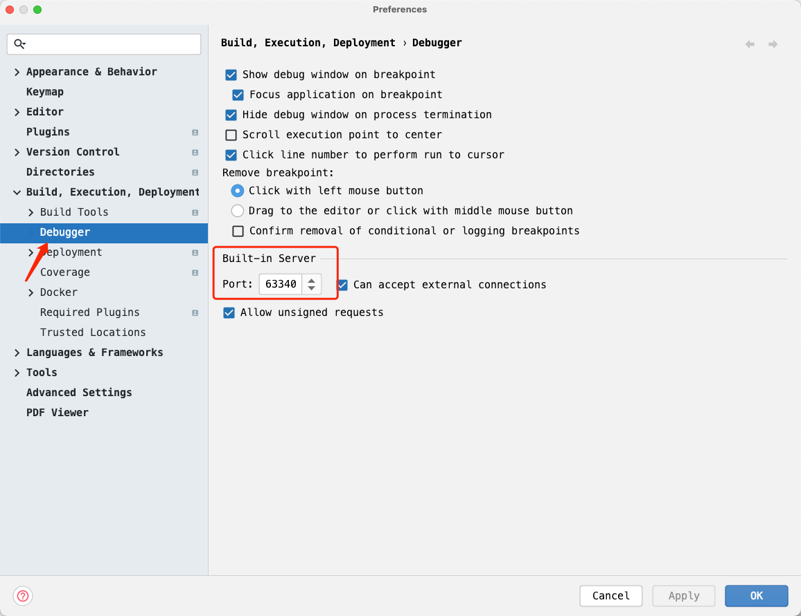

# CodeWithMe 通讯协议解析

CodeWithMe 这个功能想必大家都知道，就是用 WebStorm 来远程连接另一个 WebStorm 实例，实现结对编程等功能。

那么这里就涉及到客户端WebStorm实例、服务端WebStorm实例，以及它们之间的通讯协议。

## 架构

> 此处需要一张架构图

> 注意，一个 WebStorm 实例要么是客户端，要么是服务端，不能同时作为客户端和服务端使用。同一台主机最多只能有一个服务端实例，但可以有多个客户端实例。

当启动 WebStorm 的 CodeWithMe 功能后，该 WebStorm 实例将变成一个服务端实例，该服务的端口会从 63342 开始向上查找一个可用的端口号，然后根据当前的项目名生成一个连接字符串，格式如下：

```
https://code-with-me.jetbrains.com.cn/Kt1KzUv9Fgg-9KS10Qnw-A#p=WS&fp=C8EDD6841DF75B7CB7053D104EA87635D5FEFFCFC3E5065FCC9A5112D8774704
```

我们来分析下这个连接字符串中包含了哪些信息。

| 字段   | 值                                | 目的猜测     |
|------|----------------------------------|----------|
| 域名   | code-with-me.jetbrains.com.cn    |          |
| 路径   | Kt1KzUv9Fgg-9KS10Qnw-A           | 项目标识     |
| p参数  | WS                               | 通讯协议     |
| fp参数 | C8EDD6841DF75B7CB7053D104EA87... | 服务端证书的指纹 |

目前，同一台机器上只能启动一个 CodeWithMe 服务端实例，也就是说，服务端WebStorm实例只能绑定到一个项目上

## 通讯协议

客户端可以通过下面的请求查询服务器的端口号，以及协议版本：

> [port] 部分从 63342 开始往上遍历10个端口，检查服务端到底是运行在哪个端口上。
> 另外，WebStorm 有一个内置服务器，这个内置服务器的端口也可以访问到 CodeWithMe 服务实例。
> 

```http request
POST http://localhost:[port]/codeWithMe/queryThinClient
Origin: https://code-with-me.jetbrains.com.cn
Content-Type: text/plain

https://code-with-me.jetbrains.com.cn/Kt1KzUv9Fgg-9KS10Qnw-A#p=WS&fp=C8EDD6841DF75B7CB7053D104EA87635D5FEFFCFC3E5065FCC9A5112D8774704
```
这个接口返回当前的版本号，目前为4.

然后通过下面的请求连接服务器：
```http request
POST http://localhost:[port]/codeWithMe/connectThinClient
Origin: https://code-with-me.jetbrains.com.cn
Content-Type: text/plain

https://code-with-me.jetbrains.com.cn/Kt1KzUv9Fgg-9KS10Qnw-A#p=WS&fp=C8EDD6841DF75B7CB7053D104EA87635D5FEFFCFC3E5065FCC9A5112D8774704
```
这个接口会启动客户端 WebStorm 本地的 JetBrains Client 程序，然后用连接字符串连接服务端的 WebStorm 实例。

## 参考
- https://www.jetbrains.com/help/idea/code-with-me.html
