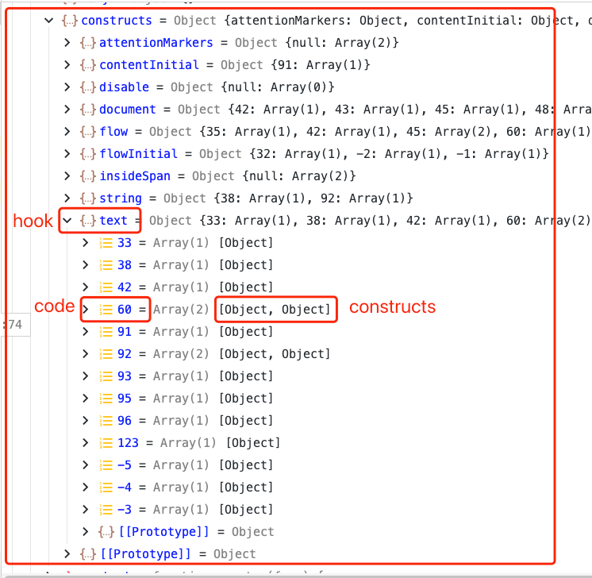
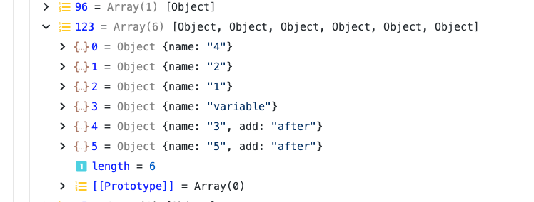

<style>
details {
    --color: red;
    --padding: 2em;
    --line-width: 2px;

    position: relative;
    padding-left: var(--padding);
}
details[open]::before {
    content: " ";
    display: block;
    width: var(--line-width);
    position: absolute;
    top: 8px;
    bottom: 0;
    left: 4px;
    background: var(--color);
}
summary {
    color: var(--color);
    margin-left: calc(-1 * var(--padding) + 0px);
}
</style>

# micromark 研究之路

`micromark`是一款 markdown parser，可用于将 markdown 文本转为 html 格式。与普通意义上的 parser
最大的区别就是其内部流程中并没有使用`AST`，而是直接根据`Token`(也叫`events`)生成 html，整个流程如下：

```txt
                                            micromark
+-----------------------------------------------------------------------------------------------+
|            +------------+         +-------+         +-------------+         +---------+       |
| -markdown->+ preprocess +-chunks->+ parse +-events->+ postprocess +-events->+ compile +-html- |
|            +------------+         +-------+         +-------------+         +---------+       |
+-----------------------------------------------------------------------------------------------+
```

整个流程我们可以分成2部分来看待，解析(parse)与编译(compile):

- parse: 从`markdown`文本到`events`数组，主要就是`Tokenize`过程；
- compile: 从`events`数组到`html`文本。

> 从上图中也可以看到，`parse`和`postprocess`这两个过程都生成`events`数组。那为什么要分成2步来做这件事呢？
> 
> 或许跟`markdown`的解析策略有关，因为`markdown`的构造块是由`block`和`inline`元素组成，解析时需要先解析出`block`列表，然后再解析`block`内部的`inline`元素。
> 具体可以参考 [CommonMark 官方给出的解析策略](https://spec.commonmark.org/0.31.2/#appendix-a-parsing-strategy)


但是毕竟对语法的处理使用`AST`更方便，为了能够使用`AST`，我们需要使用`mdast-util-from-markdown`
这个包，这个包依赖于`micromark`，但是重写了它的后半部分`compile`逻辑，也就是将`micromark`前半部分的输出(`events`)
编译为`AST` (采用 [mdast](https://github.com/syntax-tree/mdast) 标准)。

<details>
<summary>查看 `mdast-util-from-markdown` 细节</summary>

`mdast-util-from-markdown`这个包很简单，只导出了一个`fromMarkdown`函数，其伪代码如下：

```js
import {preprocess, parse, postprocess} from 'micromark'

function fromMarkdown(value, encoding, options) {
    return compiler(options)(
        postprocess(
            parse(options)
                .document()
                .write(preprocess()(value, encoding, true))
        )
    )

    // 自定义 compile 函数，用于将 events 编译为 ast
    function compiler(options) {
        return compile
    }
}
```

可以看到，解析部分直接用的`micromark`的流程，然后重写了`compile`部分来生成`AST`。
</details>


下面是一幅在
Github上讨论的一篇关于 [为什么我们需要同时有 micromark 插件和 fromMarkdown 插件？](https://github.com/orgs/remarkjs/discussions/869#discussioncomment-1602674)
帖子中的图，直观的展示了`micromark`插件与`mdast-util-from-markdown`及`mdast-util-to-markdown`插件在整个处理流程中所处的位置及作用：

```txt
1. Input            | .~~~~ ['#','F','o','o','EOL'] <~~~ file.md
                    | |
2. Tokenize         | `~~~~ micromark(string)~~~~~~~~~~~~~~~~~~~~~~~~~~~~~~~~~~.
                    |                                                          o)-- micromarkExtension()
3. Token Stream     | .~~ ['enter:atxHeading','F','o','o','exit:atxHeading'] ~~'
                    | |
4. Grow Syntax Tree | `~~~> mdast-util-from-markdown(tokens) ~~~~~~~~~~~~~~~~~~.
                    |                                                 o        o)-- fromMarkdownExtension()
5. Transform Tree   | .~~~~~ transform(treeNode) => treeNode ~~~~~~~ / \  ~~~~~'
                    | |                                             o   o
6. Serialize        | `~~~~ mdast-util-to-markdown(tree) ~~~~~~~~~~~~~~~~~~~~~~.
                    |                                                          o)-- toMarkdownExtension()
7. Output           | <~~~~ ['#','F','o','o','EOL'] <~~~~~~~~~~~~~~~~~~~~~~~~~~'
```

图中第3行的`Token Stream`就是我们说的`events`。

从上图可知，如果我们想要扩展 markdown 语法，需要编写自定义的`micromark`插件来生成自定义的`event`，然后再用`fromMarkdown`
插件将这些自定义的`event`编译成自定义的`AST`节点。到了`AST`这一步，我们就可以根据需要组合其他工具对`AST`进行转换了。

另外，还有一个`remark`相关的包，这个包与上面的`micromark`和`mdast-util-from-markdown`是什么关系呢？

我们看下`remark-parse`包的伪代码：

```js
import {fromMarkdown} from 'mdast-util-from-markdown'

function remarkParse(options) {
    const self = this

    self.parser = (doc) => {
        return fromMarkdown(doc, {
            ...options,
            extensions: self.data('micromarkExtensions'),
            mdastExtensions: self.data('fromMarkdownExtensions'),
        })
    }
}
```

可以看到，`remark-parse`也是用的`mdast-util-from-markdown`包生成`AST`，那么也是间接使用`micromark`解析 markdown。

而`remark`是对`remark-parse`和`remark-stringify`的进一步封装，代码就更简单了：

```js
import {unified} from 'unified'
import remarkParse from 'remark-parse'
import remarkStringify from 'remark-stringify'

export const remark = unified()
    .use(remarkParse)
    .use(remarkStringify)
    .freeze()
```

## 预处理(preprocess)

预处理过程如下：

```txt
+------------------------------------+
|            +------------+          |
| -markdown->+ preprocess +-chunks-> |
|            +------------+          |
+------------------------------------+
```

就是将 markdown 文本内容处理成 chunks 数组，具体是如何处理的呢？很简单，将 markdown
文本中所有符合这个正则`/[\0\t\n\r]/g`的字符进行替换，替换规则如下：

| 字符            |                  替换为                   |
|:--------------|:--------------------------------------:|
| `\0`          |             65533 (字符�的编码)             |
| `\t`          | [-2, -1, ...] (填充-1以便后面的字符满足tab的列对齐4n) |
| `\n (LF)`     |                   -4                   |
| `\r (CR)`     |                   -5                   |
| `\r\n (CRLF)` |                   -3                   |


<details>
<summary>查看示例</summary>

```txt
`ab\0cd\tef\ngh\rij\r\nk`

=>

["ab", 65533, "cd", -2, -1, -1, "ef", -4, "gh", -5, "ij", -3, "k", null]
  ^^     ^     ^^    ^   ^   ^   ^                                   ^
  ||     |           |           |                                   |
  01     2           5           8                                  eof

(中间填充的2个 -1 就是为了后面的字符 e 处于8这一列，也就是tab列对齐)
```

<details>
<summary>嵌套details</summary>

这是嵌套的details标签
</details>

</details>


## 解析(parse)

解析过程如下：

```txt
+-----------------------------+
|          +-------+          |
| -chunks->+ parse +-events-> |
|          +-------+          |
+-----------------------------+
```

就是将预处理的 chunks 数组解析为 events 数组，只不过这一步只解析到`block`结构，不进行`inline`元素的解析。

这一阶段会把行内元素用`ContentType`标记，并留在`postprocess`阶段再进行解析。

<details>
<summary>查看示例</summary>

下面这段4行的`markdown`文本的解析结果：
```text
> Lorem ipsum dolor
sit amet.
> - Qui *quodsi iracundia*
> - aliquando id
```

```text
[->]: blockQuote
    [->]: blockQuotePrefix
        [->]: blockQuoteMarker
        [<-]: blockQuoteMarker
        [->]: blockQuotePrefixWhitespace
        [<-]: blockQuotePrefixWhitespace
    [<-]: blockQuotePrefix
    [->]: chunkFlow (contentType: flow)
    [<-]: chunkFlow (contentType: flow)
    [->]: chunkFlow (contentType: flow)
    [<-]: chunkFlow (contentType: flow)
    [->]: blockQuotePrefix
        [->]: blockQuoteMarker
        [<-]: blockQuoteMarker
        [->]: blockQuotePrefixWhitespace
        [<-]: blockQuotePrefixWhitespace
    [<-]: blockQuotePrefix
    [->]: listUnordered
        [->]: listItemPrefix
            [->]: listItemMarker
            [<-]: listItemMarker
            [->]: listItemPrefixWhitespace
            [<-]: listItemPrefixWhitespace
        [<-]: listItemPrefix
        [->]: chunkFlow (contentType: flow)
        [<-]: chunkFlow (contentType: flow)
        [->]: blockQuotePrefix
            [->]: blockQuoteMarker
            [<-]: blockQuoteMarker
            [->]: blockQuotePrefixWhitespace
            [<-]: blockQuotePrefixWhitespace
        [<-]: blockQuotePrefix
        [->]: listItemPrefix
            [->]: listItemMarker
            [<-]: listItemMarker
            [->]: listItemPrefixWhitespace
            [<-]: listItemPrefixWhitespace
        [<-]: listItemPrefix
        [->]: chunkFlow (contentType: flow)
        [<-]: chunkFlow (contentType: flow)
    [<-]: listUnordered
[<-]: blockQuote
```

</details>

这个过程的代码如下：

```js
const parser = parse({
    extensions: [
        ext1,
        ext2,
        // ...,
        extN,
    ],
})
const events = parser.document().write(chunks)
```
调用`parse`函数并传入需要的`extension`，返回解析器对象`parser`。`parser`中有一个很重要的属性就是`constructs`，你可以把这个属性当作是所有传入的`extension` merge 的结果，是解析时的主要依据。


我们先来看下`extension`长什么样。
下面是`micromark`类型定义中`Extension`的定义：
```ts
export interface Extension {
    document?: ConstructRecord | undefined
    contentInitial?: ConstructRecord | undefined
    flowInitial?: ConstructRecord | undefined
    flow?: ConstructRecord | undefined
    string?: ConstructRecord | undefined
    text?: ConstructRecord | undefined
    disable?: {null?: Array<string> | undefined} | undefined
    insideSpan?:
        | {null?: Array<Pick<Construct, 'resolveAll'>> | undefined}
        | undefined
    attentionMarkers?: {null?: Array<Code> | undefined} | undefined
}

export type ConstructRecord = Record<
    string,
    Array<Construct> | Construct | undefined
>

export type Construct = {
    tokenize: Tokenizer
    name?: string | undefined
    add?: 'after' | 'before' | undefined
}
```

下图是`parse`函数把所有传入的`extension`组合后的结果：



图中`code`对应该字符所采用的`construct`数组，其中每个`construct`在该数组中的顺序由`extension`定义中的`add`选项控制，默认为`before`。

<details>
<summary>查看construct顺序示例</summary>

```js
const parser = parse({
    extensions: [
        {
            text: {
                123: {
                    name: 'variable',
                    // add: 'before'
                }
            }
        },
        {
            text: {
                123: {
                    name: '1',
                    // add: 'before'
                }
            }
        },
        {
            text: {
                123: {
                    name: '2',
                    // add: 'before'
                }
            }
        },
        {
            text: {
                123: {
                    name: '3',
                    add: 'after'
                }
            }
        },
        {
            text: {
                123: {
                    name: '4',
                    // add: 'before'
                }
            }
        },
        {
            text: {
                123: {
                    name: '5',
                    add: 'after'
                }
            }
        },
    ]
})
```

上面这段代码合成的`constructs`结果如下：


</details>

<details>
<summary>如何理解 document/content/flow/string/text </summary>
</details>

`effects.consume(code)`的作用是移动当前游标(内部point)以指向下一个字符，同时将当前code保存在`context.previous`属性中。\
`effects.enter(type, fields)`的作用是创建一个类型为`type`的token，并将事件对象`['enter', token, context]`添加到内部的`context.events`数组中。\
`effects.exit(type)`的作用是将事件对象`['exit', token, context]`添加到`context.events`数组中。
`effects.check()/effects.attemp()`会尝试解析construct

## 后处理(postprocess)

解析过程如下：

```txt
+------------------------------------+
|           +-------------+          |
| -events-> + postprocess +-events-> |
|           +-------------+          |
+------------------------------------+
```
我们前面也说过了，`postprocess`阶段是用于解析`inline`元素的，这些元素已经在`parse`阶段被`ContentType`所标记。

<details>
<summary>查看示例</summary>

继续前面的示例，经过`postprocess`解析后的结果如下：
```text
[->]: blockQuote
    [->]: blockQuotePrefix
        [->]: blockQuoteMarker
        [<-]: blockQuoteMarker
        [->]: blockQuotePrefixWhitespace
        [<-]: blockQuotePrefixWhitespace
    [<-]: blockQuotePrefix
    [->]: content
        [->]: paragraph
            [->]: data
            [<-]: data
            [->]: lineEnding
            [<-]: lineEnding
            [->]: data
            [<-]: data
        [<-]: paragraph
    [<-]: content
    [->]: lineEnding
    [<-]: lineEnding
    [->]: blockQuotePrefix
        [->]: blockQuoteMarker
        [<-]: blockQuoteMarker
        [->]: blockQuotePrefixWhitespace
        [<-]: blockQuotePrefixWhitespace
    [<-]: blockQuotePrefix
    [->]: listUnordered
        [->]: listItemPrefix
            [->]: listItemMarker
            [<-]: listItemMarker
            [->]: listItemPrefixWhitespace
            [<-]: listItemPrefixWhitespace
        [<-]: listItemPrefix
        [->]: content
            [->]: paragraph
                [->]: data
                [<-]: data
                [->]: emphasis
                    [->]: emphasisSequence
                    [<-]: emphasisSequence
                    [->]: emphasisText
                        [->]: data
                        [<-]: data
                    [<-]: emphasisText
                    [->]: emphasisSequence
                    [<-]: emphasisSequence
                [<-]: emphasis
            [<-]: paragraph
        [<-]: content
        [->]: lineEnding
        [<-]: lineEnding
        [->]: blockQuotePrefix
            [->]: blockQuoteMarker
            [<-]: blockQuoteMarker
            [->]: blockQuotePrefixWhitespace
            [<-]: blockQuotePrefixWhitespace
        [<-]: blockQuotePrefix
        [->]: listItemPrefix
            [->]: listItemMarker
            [<-]: listItemMarker
            [->]: listItemPrefixWhitespace
            [<-]: listItemPrefixWhitespace
        [<-]: listItemPrefix
        [->]: content
            [->]: paragraph
                [->]: data
                [<-]: data
            [<-]: paragraph
        [<-]: content
    [<-]: listUnordered
[<-]: blockQuote
[->]: lineEnding
[<-]: lineEnding
```
</details>
