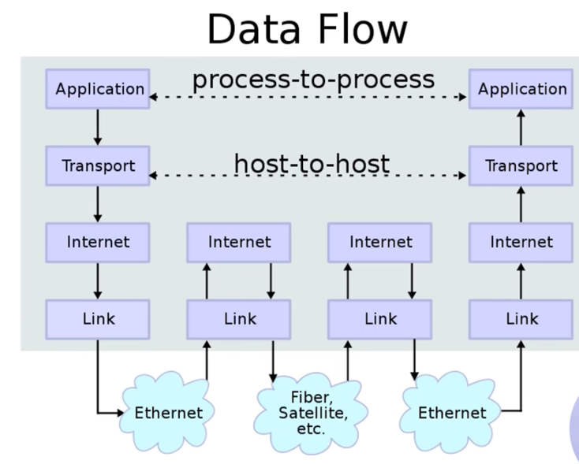
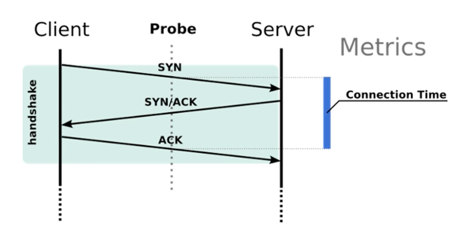
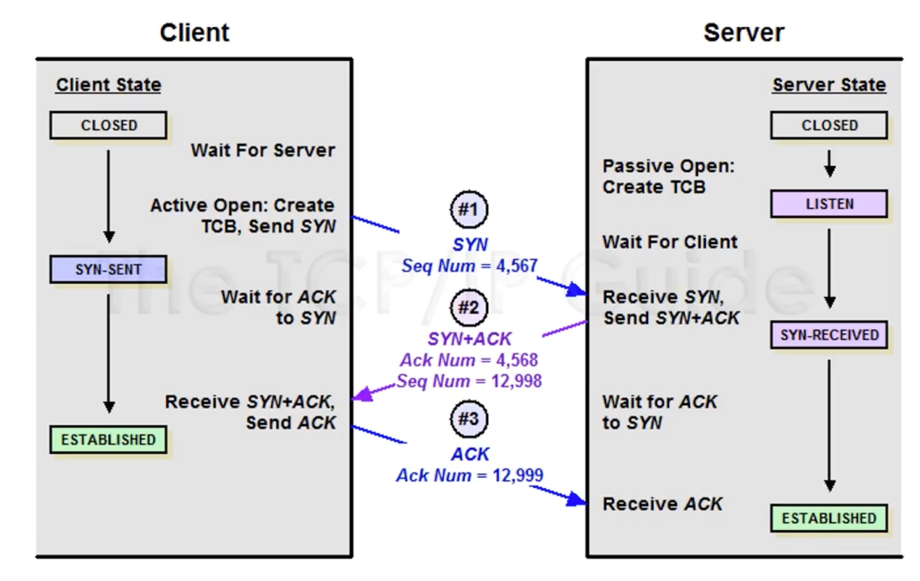
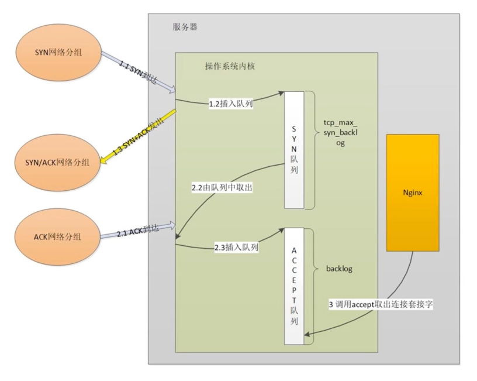
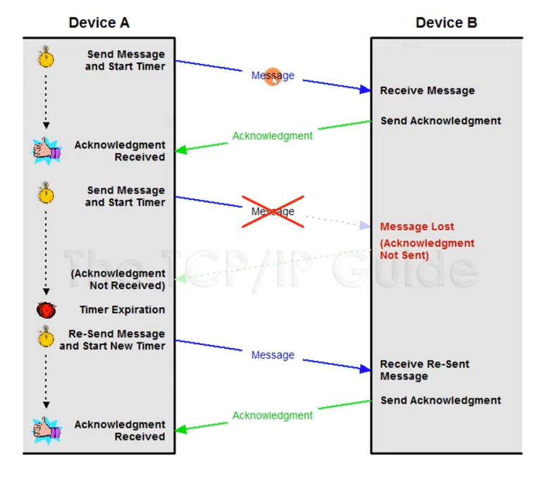
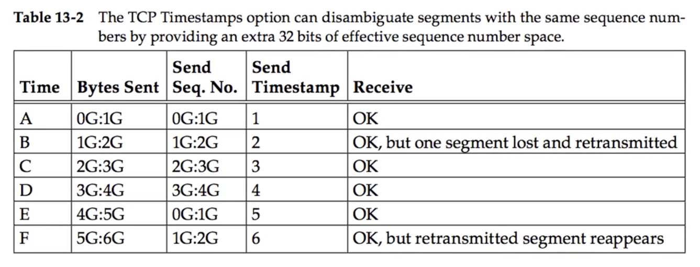

# TCP

## 一、TCP 历史及其设计哲学

TCP/IP 的前身 ARPA(Advanced Research Projects Agency Network): NCP 协议

没有分层，网络层和传输层糅合在一块。

### TCP/IP 协议发展


### TCPv4 协议分层后的互联网世界


IP 协议专注于解决如何跨域不同的网络去传输消息，传输层的 TCP 协议解决了任意长度消息的可靠传输

### TCP/IP 的七个设计理念

David D Clark: 《The Design Philosophy of The DARPA Internet Protocols》

- Internet communication must continue despite loss of networks or gateways.
- The Internet must support multiple types of communications service.
- The Internet architecture must accommodate a variety of networks.
- The Internet architecture must permit distributed management of its resources.
- The Internet architecture must be cost-effective.
- The Internet architecture must permit host attachment with a low level of effort.
- The resources used in the internet architecture must be accountable.

## 二、TCP 解决了哪些问题

### TCP 的作用


- TCP: 面向连接的、可靠的、基于字节流的传输层通信协议
- IP: 根据 IP 地址穿越网络传输数据



### 层层嵌套的“信封”: 报文头部


### 报文头部的层层组装与卸载


不可靠的网络传输
- 网络设备
- 主机
- 物理链路

### TCP 协议特点

在 IP 协议之上，解决网络通讯可依赖问题

- 点对点（不能广播、多播），面向连接
- 双向传输（全双工）
- 字节流：打包成报文段、保证有序接收、重复报文自动丢弃
  - 缺点：不维护应用报文的边界（对比 HTTP、GRPC）
  - 优点：不强制要求应用必须离散的创建数据块，不限制数据块的大小
- 流量缓冲：解决速度不匹配问题
- 可靠的传输服务（保证可达，丢包时通过重发进而增加时延实现可靠性）
- 拥塞控制

## 三、TCP 报文格式

### IP 头部


### UDP 头部


### TCP 协议的任务

- 主机内的进程寻址(通过端口)
- 创建、管理、终止连接
- 处理并将字节流打包成报文段(如 IP 报文)
- 传输数据
- 保持可靠性与传输质量
- 流控制与拥塞控制

### 如何标识一个连接？

TCP 四元组 (源地址，源端口，目的地址，目的端口)

没有连接ID: QUIC 协议

### TCP Segment 报文段


- 控制信息
  - 寻址
  - 滑动窗口
  - Flags
  - 校验和
- 数据

### TCP 常用选项 (TCP Option)

| 类型  | 总长度(字节) | 数据             | 描述                       |
|-----|---------|----------------|--------------------------|
| 0   | -       | -              | 选项列表末尾标识                 |
| 1   | -       | -              | 无意义，用于32位对齐使用            |
| 2   | 4       | MSS值           | 握手时发送端告知可以接收的最大报文段大小     |
| 3   | 3       | 窗口移位           | 指明最大窗口扩展后的大小             |
| 4   | 2       | -              | 表明支持 SACK 选择性确认中间报文段功能   |
| 5   | 可变      | 确认报文段          | 选择性确认窗口中间的 Segments 报文段  |
| 8   | 10      | Timestamps 时间戳 | 用于更精准的计算 RTT，及解决 PAWS 问题 |
| 14  | 3       | 校验和算法          | 双方认可后，可使用新的校验和算法         |
| 15  | 可变      | 校验和            | 当16位标准校验和放不下时，放置在这里      |
| 34  | 可变      | FOC            | TFO 中 Cookie             |

## 四、如何使用 tcpdump 分析网络报文

### 捕获及停止条件

- -D 列举所有网卡设备
- -i 选择网卡设备
- -c 抓取多少条报文
- --time-stamp-precision 指定捕获时的时间精度，默认微秒(micro)，可选纳秒(nano)
- -s 指定每条报文的最大字节数，默认 262144 字节

### 文件操作

- -w 输出结果至文件
- -C 限制单个输出文件的大小，超出后以后缀加1等数字的形式递增(注意单位是1,000,000字节)
- -W 指定输出文件的最大数量，到达后会重新覆写第1个文件
- -G 指定每隔N秒就重新输出至新文件，注意 -w 参数应基于 strftime 参数指定文件名
- -r 读取一个抓包文件
- -V 将待读取的多个文件名写入一个文件中，通过读取该文件同时读取多个文件

| 说明符 | 替换为                             |
|-----|---------------------------------|
| %a  | 缩写的星期几名称                        |
| %A  | 完整的星期几名称                        |
| %b  | 缩写的月份名称                         |
| %B  | 完整的月份名称                         |
| %c  | 日期和时间表示法                        |
| %d  | 一月中的第几天(01-31)                  |
| %H  | 24小时格式的小时(00-23)                |
| %i  | 12小时格式的小时(01-12)                |
| %j  | 一年中的第几天(001-366)                |
| %m  | 十进制数表示的月份(01-12)                |
| %M  | 分(00-59)                        |
| %p  | AM或PM名称                         |
| %S  | 秒(00-61)                        |
| %U  | 一年中的第几周，以第一个星期日作为第一周的第一天(00-53) |
| %w  | 十进制数表示的星期几，星期日表示为0 (0-6)        |
| %W  | 一年中的第几周，以第一个星期一作为第一周的第一天(00-53) |
| %x  | 日期表示法                           |
| %X  | 时间表示法                           |
| %y  | 年份，最后两个数字 (00-99)               |
| %Y  | 年份                              |
| %Z  | 时区的名称或缩写                        |
| %%  | 一个 % 符号                         |

#### 示例

```shell
# 抓2个包并写入文件a
tcpdump -c 2 -w a

# 从文件a中读取
tcpdump -r a

# -C指定一个文件最多为1M，最多写3个文件
tcpdump -C 1 -W 3

# 每隔3秒写入一个新文件
tcpdump -G 3 -w def%M-%S
```

### 输出时间戳格式

- -t 不显示时间戳
- -tt 自 1970年1月1日0点 至今的秒数
- -ttt 显示邻近两行报文间经过的秒数
- -tttt 带日期的完整时间
- -ttttt 自第一个抓取的报文起经过的秒数

### 分析信息详情

- -e 显示数据链路层头部
- -q 不显示传输层信息
- -v 显示网络层头部更多的信息，如 TTL、id 等
- -n 显示 IP 地址、数字端口代替 hostname 等
- -S TCP 信息以绝对序列号替代相对序列号
- -A 以 ASCII 方式显示报文内容，适用于 HTTP 分析
- -x 以 16进制方式显示报文内容，不显示数据链路层
- -xx 以 16进制方式显示报文内容，显示数据链路层
- -X 同时以 16进制及 ASCII 方式显示报文内容，不显示数据链路层
- -XX 同时以 16进制及 ASCII 方式显示报文内容，显示数据链路层


## 五、三次握手建立连接

### 握手的目标

- 同步 Sequence 序列号
  - 初始序列号 ISN (Initial Sequence Number)
- 交换 TCP 通讯参数
  - 如 MSS、窗口比例因子、选择性确认、指定校验和算法

### 三次握手



- SYN: 同步
- ACK: 确认

#### 三次握手(1): SYN 报文


#### 三次握手(2): SYN/ACK 报文


#### 三次握手(3): ACK 报文


## 六、三次握手过程中的状态变迁

### 三次握手流程



- CLOSED
- LISTEN
- SYN-SENT
- SYN-RECEIVED
- ESTABLISHED

> 查看连接状态
> netstat -an | grep tcp

### netstat 命令查看 TCP 状态

- interval: 重新显示选定的统计信息，各个显示间暂停的间隔秒数
- -a: 显示所有连接和侦听端口
- -n: 以数字形式(如 IP 地址)显示地址和端口号
- -r: 显示路由表
- -s: 显示每个协议的统计信息
- -o(Windows): 显示拥有的与每个连接关联的进程 ID
- -b(Windows)/-p(Linux): 显示对应的可执行程序名字

### 两端同时发送 SYN: 双方使用固定源端口且同时建立连接


TCB: Transmission Control Block, 保存连接使用的源端口、目的端口、目的ip、序号、应答序号、对方窗口大小、己方窗口大小、tcp状态、tcp输入/输出队列、应用层输出队列、tcp的重传有关变量等。


## 七、三次握手中的性能优化与安全问题

### 服务器三次握手流程示例


### 超时时间与缓冲队列

- 应用层 connect 超时时间调整
- 操作系统内核限制调整
  - 服务器端 SYN_RCV 状态
    - net.ipv4.tcp_max_syn_backlog: SYN_RCVD 状态连接的最大个数
    - net.ipv4.tcp_synack_retries: 被动建立连接时，发 SYN/ACK 的重试次数
  - 客户端 SYN_SENT 状态
    - net.ipv4.tcp_syn_retries = 6 主动建立连接时，发 SYN 的重试次数
    - net.ipv4.ip_local_port_range = 32768 609999 建立连接时的本地端口可用范围
  - ACCEPT 队列设置

### Fast Open 降低时延


### Linux 上打开 TCP Fast Open

- net.ipv4.tcp_fastopen: 系统开启 TFO 功能
  - 0: 关闭
  - 1: 作为客户端时可以使用 TFO
  - 2: 作为服务器时可以使用 TFO
  - 3: 无论作为客户端还是服务器，都可以使用 TFO

### 如何应对 SYN 攻击？

攻击者短时间伪造不同 IP 地址的 SYN 报文，快速占满 backlog 队列，使服务器不能为正常用户服务

- net.core.netdev_max_backlog
  - 接收自网卡、但未被内核协议栈处理的报文队列长度
- net.ipv4.tcp_max_syn_backlog
  - SYN_RCVD 状态连接的最大个数
- net.ipv4.tcp_abort_on_overflow
  - 超出处理能力时，对新来的 SYN 直接回包 RST，丢弃连接

### TCP_DEFER_ACCEPT



服务器在收到 ACK 报文时并不激活应用程序，而是在收到实际数据后再激活应用程序，使得应用程序效率更高。


## 八、数据传输与 MSS 分段

### TCP 应用层编程示例


### TCP 流与报文段

- 流分段的依据
  - MSS: 防止 IP 层分段
  - 流控: 接收端的能力


### MSS: Max Segment Size

定义：仅指 TCP 承载数据，不包含 TCP 头部的大小，参见 RFC879

MSS 选择的目的：
- 尽量每个 Segment 报文段携带更多的数据，以减少头部空间占用比率
- 防止 Segment 被某个设备的 IP 层基于 MTU 拆分

默认 MSS: 536字节 (默认 MTU=576字节，20字节IP头部，20字节TCP头部)

握手阶段协商MSS

MSS分类：
- 发送方最大报文段 SMSS: Sender Maximum Segment Size
- 接收方最大报文段 RMSS: Receiver Maximum Segment Size


## 九、重传与确认

### 报文有可能丢失


### PAR: Positive Acknowledgment with Retransmission



发送每个消息的时候，设置一个定时器，在定时器内收到ack则表示成功，否则就重发改消息。

问题：只能串行发送消息，效率低下。

### 提升并发能力的 PAR 改进版


每个消息加上标识，ack时带上这个标识。

问题：标识的粒度太大，是针对每个报文而不是字节。

### Sequence 序列号/Ack 序列号

设计目的：解决应用层字节流的可靠发送
- 跟踪应用层的发送端数据是否送达
- 确定接收端有序的接收到字节流

序列号的值针对的是字节而不是报文

### 确认序号


### PAWS: Protect Against Wrapped Sequence numbers

防止序列号回绕



### BDP 网络中的问题

TCP timestamp

- 更精准的计算 RTO
- PAWS

## 十、RTO 重传定时器的计算

### 如何测量 RTT


### 如何在重传下有效测量 RTT


### RTO (Retransmission TimeOut) 应该设多大？

RTO 应该略大于 RTT


### RTO 应当更平滑

平滑 RTO: RFC793，降低瞬时变化

- SRTT (smoothed round-trip time) = (a * SRTT) + ((1-a) * RTT)
  - a 从0到1(RFC推荐0.9)，越大越平滑
- RTO = min[UBOUND, max[LBOUND, (b * SRTT)]]
  - 如 UBOUND 为1分钟，LBOUND 为1秒钟，b 从1.3到2之间
- 不适用于 RTT 波动大的场景
