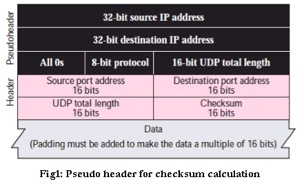
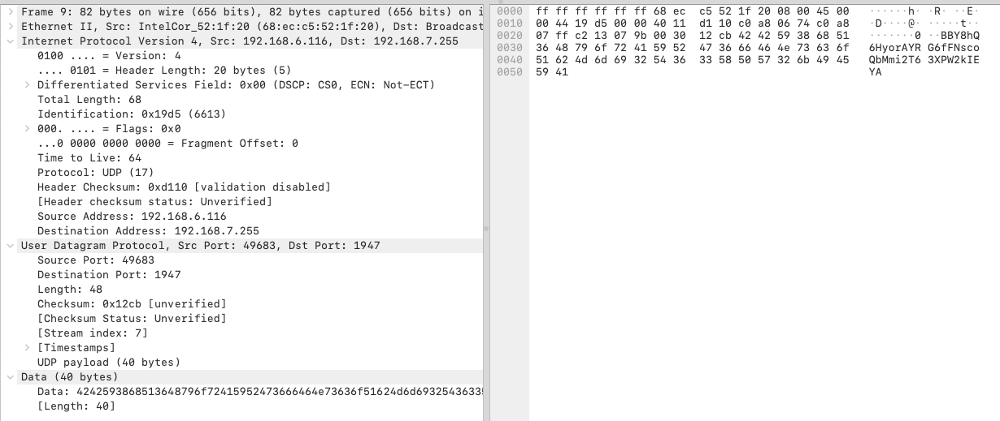

# UDP - User Datagram Protocol

> RFC 768: https://datatracker.ietf.org/doc/html/rfc768

## 格式

 0      7 8     15 16    23 24    31
+--------+--------+--------+--------+
|     Source      |   Destination   |
|      Port       |      Port       |
+--------+--------+--------+--------+
|                 |                 |
|     Length      |    Checksum     |
+--------+--------+--------+--------+
|
|          data octets ...
+---------------- ...

`Length`表示整个包的大小，包括头部和包体，所以最小值为8(因为UDP头是8个字节).

`Checksum`的计算方法如下：

校验和的计算涉及到三部分数据：伪头部、UDP头部和UDP数据，如上图所示。

伪头部也就是这个 UDP 数据包所在的 IP 包头部的某些信息(IP地址、协议号)组成，具体算法如下：

1. 把所有的段内容作为 16-bit 整数序列
2. 把这些 16-bit 的整数求和sum
3. 求这个sum的反码，即校验和

## Checksum 计算示例

我们整理一下相关信息：

源IP地址：192.168.6.116 (0xC0A80674)
目的IP地址：192.168.7.255 (0xC0A807FF)
协议号：17 (0x0011)
源端口：49683 (0xC213)
目的端口：1947 (0x079B)
UDP总长度：48 (0x0030)
UDP数据：省略

因此对应的 16-bit 整数分别为：
源IP地址：0xC0A8 0x0674
目的IP地址：0xC0A8 0x07FF
协议号：0x0011
UDP长度：0x0030
源端口：0xC213
目的端口：0x079B
UDP长度：0x0030
UDP数据：0x4242 0x5938 0x6851 0x3648 0x796f 0x7241 0x5952 0x4736 0x6646 0x4e73 0x636f 0x5162 0x4d6d 0x6932 0x5436 0x3358 0x5057 0x326b 0x4945 0x5941

求和：0x8ED2C

16bit 溢出了，需要将高 16bit 与低 16bit 相加：0x0008 + 0xED2C = 0xED34 (0b1110_1101_0011_0100)

取反码：0b0001_0010_1100_1011 (0x12CB)

结果：0x12CB

## 参考

- [一文搞懂 TCP 与 UDP 的区别](https://www.cnblogs.com/fundebug/p/differences-of-tcp-and-udp.html)
- [UDP 协议详解](https://zhuanlan.zhihu.com/p/357080855)
