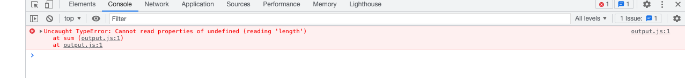
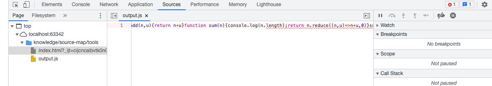
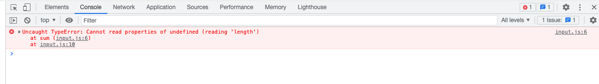
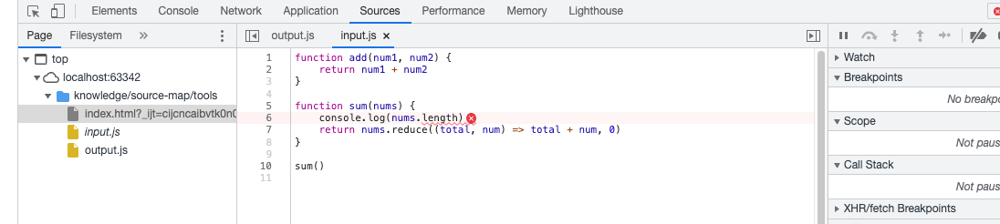
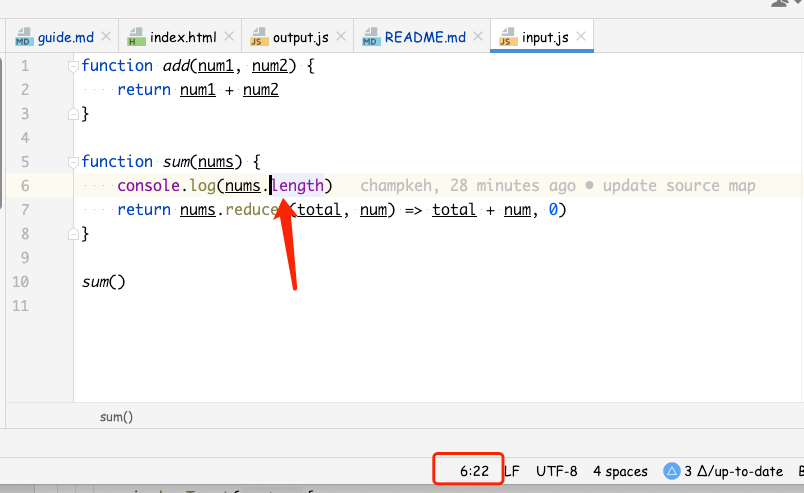
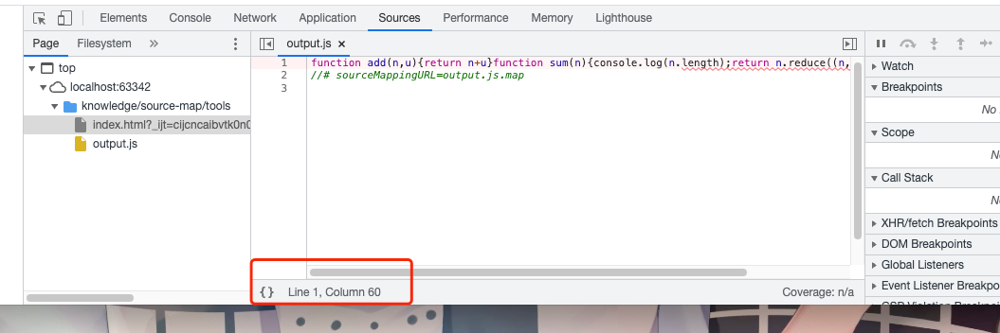

# 研究 Source Map 在调试中的作用

## 一、source map 在调试中的作用

### 1. 准备测试文件`input.js`
```js
function add(num1, num2) {
    return num1 + num2
}

function sum(nums) {
    console.log(nums.length)
    return nums.reduce((total, num) => total + num, 0)
}

sum()
```

### 2. 生成一个source map文件
采用`uglifyjs`这个包，命令如下：
```shell
$ uglifyjs input.js -m -o output.js --source-map
```
这条命令会生成2个文件：`output.js`和`output.js.map`。

`output.js`内容如下：
```js
function add(n,u){return n+u}function sum(n){console.log(n.length);return n.reduce((n,u)=>n+u,0)}sum();
```

`output.js.map`内容如下：
```json
{
  "version": 3,
  "sources": [
    "input.js"
  ],
  "names": [
    "add",
    "num1",
    "num2",
    "sum",
    "nums",
    "console",
    "log",
    "length",
    "reduce",
    "total",
    "num"
  ],
  "mappings": "AAAA,SAASA,IAAIC,EAAMC,GACf,OAAOD,EAAOC,EAGlB,SAASC,IAAIC,GACTC,QAAQC,IAAIF,EAAKG,QACjB,OAAOH,EAAKI,OAAO,CAACC,EAAOC,IAAQD,EAAQC,EAAK,GAGpDP"
}
```

### 3. 测试页面
```html
<!DOCTYPE html>
<html lang="en">
<head>
    <meta charset="UTF-8">
    <title>Title</title>
</head>
<body>
<script src="output.js"></script>
</body>
</html>
```
我们在`html`文件中直接引用`output.js`文件，这个文件的内容上面已经说过了，由于我们在调用`sum()`函数时没有传递参数，所以内部访问`nums.length`时是会抛出异常的。

#### 无 source map
我们先看下没有source map的情况下，js报错是什么样的：
，如下：


可以看到，在`output.js`的第1行的`sum`函数处报错了，我们点开这个`output.js`文件的报错位置，如下：

代码是压缩过的，并不是源码，不方便调试。

#### 有 source map
接下来，我们在`output.js`文件的最后添加下面这行代码：
```js
//# sourceMappingURL=output.js.map
```
此时，`output.js`的内容如下：
```js
function add(n,u){return n+u}function sum(n){console.log(n.length);return n.reduce((n,u)=>n+u,0)}sum();
//# sourceMappingURL=output.js.map
```
我们再看一下报错信息：

可以看到，报错信息已经变成了在`input.js`的第6行报错了，打开报错位置如下：

此时，我们打开的已经是我们的源码文件了，并且看到了源码的第6行在访问`length`属性时报错了。这极大地提升了我们的开发调试体验。

> 如果加了 sourceMappingURL 之后还是报的`ouput.js`文件的错，那要看下开发工具是否启用了`SourceMap`。
> 
> 点开devtools右上角的设置
> 
> 打开如下面板：
> 
> 确认`Enable JavaScript source maps`选项是勾选的。


## 二、探索source map位置映射原理

我们用工具`decode.js`对source map文件处理一下，将`mappings`字段变成下面这样的格式：
```
"mappings": {
  "0": [
   ^
   └── the line number of the output file

    "231 => source.js 5:64 foo"
      ^        ^       ^    ^
      │        │       │    └── the symbol name from the source file
      │        │       │
      │        │       └── the line:column position in the source file
      │        │
      │        └── the name of the source file
      │
      └── the column number of the output file

  ]
}
```

命令如下：
```shell
$ cat output.js.map | node decode > output2.js.map
```

最终，`output2.js.map`文件的内容如下：
```json
{
  "version": 3,
  "sources": [
    "input.js"
  ],
  "names": [
    "add",
    "num1",
    "num2",
    "sum",
    "nums",
    "console",
    "log",
    "length",
    "reduce",
    "total",
    "num"
  ],
  "mappings": {
    "1": [
      "1 => input.js 1:1 add",
      "10 => input.js 1:10 add",
      "14 => input.js 1:14 num1",
      "16 => input.js 1:20 num2",
      "19 => input.js 2:5 num2",
      "26 => input.js 2:12 num1",
      "28 => input.js 2:19 num2",
      "30 => input.js 5:1 num2",
      "39 => input.js 5:10 sum",
      "43 => input.js 5:14 nums",
      "46 => input.js 6:5 console",
      "54 => input.js 6:13 log",
      "58 => input.js 6:17 nums",
      "60 => input.js 6:22 length",
      "68 => input.js 7:5 length",
      "75 => input.js 7:12 nums",
      "77 => input.js 7:17 reduce",
      "84 => input.js 7:24 reduce",
      "85 => input.js 7:25 total",
      "87 => input.js 7:32 num",
      "91 => input.js 7:40 total",
      "93 => input.js 7:48 num",
      "95 => input.js 7:53 num",
      "98 => input.js 10:1 sum"
    ]
  }
}
```
