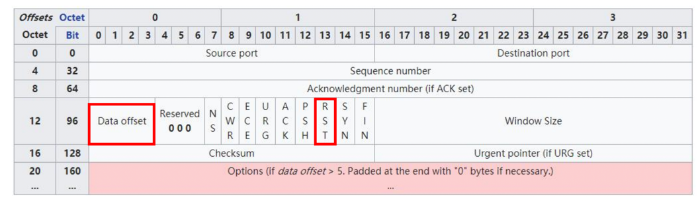
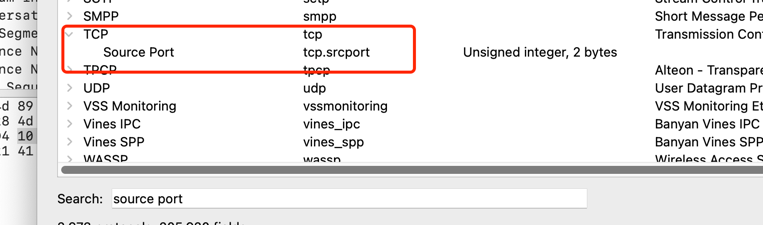

# WebSocket 学习

## 协议

- WebSocket 格式 [RFC6445](https://www.rfc-editor.org/rfc/rfc6455.html)
- WebSocket 压缩扩展 [RFC7692](https://www.rfc-editor.org/rfc/rfc7692.html)

## Wireshark 捕获过滤器: BPF语法

> https://biot.com/capstats/bpf.html

### Expression 过滤表达式

由多个原语(primitive)组成，原语可以进行简单的逻辑运算，比如与或非(&&/and、||/or、!/not)

原语(primitive)由一个**名称或数字**，以及描述它的多个限定词(qualifier)组成。

限定词(qualifier)有4种类型：

- type: 限定它所描述的**名称或数字**所指示的**类型**，这一类型的限定词有
  - host、port 分别它所限定的对象是主机和端口
  - net 表示它所限定的对象是一个子网
  - portrange 表示它所限定的对象是一个端口范围
- dir: 限定网络**出入方向**
  - src
  - dst
  - src or dst 默认
  - src and dst
- proto: 限定**协议类型**
  - ether/fddi/tr/wlan/ip/ip6/arp/rarp/decnet/tcp/udp/icmp/igmp/igrp/pim/ah/esp/vrrp
- 其他
  - gateway: 指定网关 IP 地址
  - broadcast: 广播报文
  - multicast: 多播报文
  - less, greater: 小于或者大于

### 示例

1. 指定主机
```
host www.baidu.com
```

2. 指定端口范围
```
portrange 6000-8000
```

3. 指定子网
```
net 192.168.0.0 mask 255.255.255.0
net 192.168.0.0/24
```

4. 指定端口范围与协议
```
src or dst portrange 5000-8000 && tcp or ip6
```

5. 指定网关
```
gateway 192.168.1.1 // 这句不合法，这里只是表示语义与下面相同
ether host 192.168.1.1 and not host 192.168.1.1
```

### 基于协议域过滤



1. 捕获所有 TCP 中的 RST 报文
```
tcp[13] & 4 == 4
```

2. 抓取 HTTP GET 报文
```
// 0x47455420 指的是 "GET "，也就是说TCP报文头部后面是"GET "字符串就表示GET请求
port 80 and tcp[((tcp[12:1] & 0xF0) >> 4 * 4):4] == 0x47455420
port 80 and tcp[((tcp[12:1] & 0xF0) * 4):4] == 0x47455420
port 80 and tcp[((tcp[12:1] & 0xF0) >> 2):4] == 0x47455420
```
> 对这个表达式的解释可以参考 https://security.stackexchange.com/questions/121011/wireshark-tcp-filter-tcptcp121-0xf0-24


## Wireshark 显示过滤器

### 过滤属性

任何在报文细节面板中解析出的字段名，都可以作为过滤属性。
例如，在报文细节面板中 TCP 协议头中的 Source Port，对应的过滤属性为 tcp.srcport

在 View -> Internals -> Supported Protocols 面板中，可以看到各字段对应的属性名。


### 操作符

| 英文       | 符号  | 描述  | 示例                      |
|----------|-----|-----|-------------------------|
| eq       | `==` | 等于  | ip.src == 10.0.0.5      |
| ne       | `!=` | 不等于 | ip.src != 10.0.0.5      |
| gt       | `>` | 大于 | frame.len > 10          |
| lt       | `<` | 小于 | frame.len < 128         |
| ge       | `>=` | 大于等于 | frame.len ge 0x100      |
| le       | `<=` | 小于等于 | frame.len <= 0x20       |
| contains |     | 包含 | sip.To contains "a1762" |
| matches  | `~`  | 正则匹配 | host matches "acme\.(org)" |
| bitwise_and | `&` | 位与操作 | tcp.flags & 0x02        |

### 过滤值类型

| 类型 | 描述                 | 示例                                               |
|---|--------------------|--------------------------------------------------|
| Unsigned integer | 无符号整型              | ip.len le 1500                                   |
| Signed integer | 有符号整型              |                                                  |
| Boolean | 布尔值                | tcp.flags.syn                                    |
| Ethernet address | 以太网地址，以:-.分隔的6字节地址 | eth.dst == ff:ff:ff:ff:ff:ff                     |
| IPv4 address | IPv4 地址            | ip.addr == 192.168.0.1                           |
| IPv6 address | IPv6 地址            | ipv6.addr == ::1                                 |
| Text string | 文本字符串              | http.request.uri == "https://www.wireshark.org/" |

### 表达式之间的组合

|英文 | 符号 | 描述 | 示例 |
|---|---|---|---|
| and | && | 逻辑与 | ip.src == 10.0.0.5 and tcp.flags.fin |
| or | ||
| xor | ^^ | 逻辑异或 | 
| not | ! | 逻辑非 |
| [...] | | 见 Slice 切片操作 |
| in | | 见集合操作 |

### 其他常见操作符

1. 大括号{}集合操作符
```
tcp.port in {443 4430..4434}
```
等价于
```
tcp.port == 443 || (tcp.port >= 4430 && tcp.port <= 4434)
```

2. 中括号[]Slice切片操作符

`[n:m]`表示 n 是起始偏移量，m 是切片长度
```
eth.src[0:3] == 00:00:83
```

`[n-m]`表示 n 是起始偏移量，m 是截止偏移量
```
eth.src[1-2] == 00:83
```

`[:m]`表示从开始处至 m 截止偏移量
```
eth.src[:4] == 00:00:83:00
```

`[m:]`表示 m 是起始偏移量，至字段结尾
```
eth.src[4:] == 20:20
```

`[m]`表示取偏移量 m 处的字节
```
eth.src[2] == 83
```

`[,]`使用逗号分隔时，允许以上方式同时出现
```
eth.src[0:3, 1-2, :4, 4:, 2] == 00:00:83:00:83:00:00:83:00:20:20:83
```

### 常用函数

1. upper
Converts a string field to uppercase

2. lower
Converts a string field to lowercase

3. len
Returns the byte length of a string or bytes field

4. count
Returns the number of field occurrences in a frame

5. string
Converts a non-string field to a string
